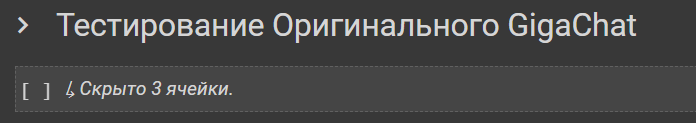
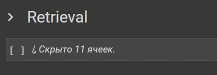
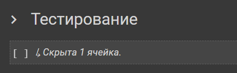
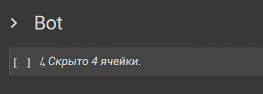

# Pharmacy_MVP_bot
Решение представлено в формате google colab ноутбуку, который доступен по ссылке https://colab.research.google.com/drive/12xF6L5FvPJpNDLeXAB3ckuDXlEgj-RPY?usp=sharing ,  
Все необходимые данные загрузятся автоматически во время запуска google colab ноутбука. 

# Краткое описание решения
В ходе решения нашей задачи мы дообучали GigaChat под нашу конкретную задачу бота фармацевта-консультанта. 
Реализовали идею путём методики RAG, для этого взяли датасеты из открытых источников, векторизовали и указали для модели подсматривать в неё во время выдачи ответа. 
Также написали конкретные инструкции для правильной выдачи ответа и создали телеграм-бота в качестве демонстрации нашего результата.  

# Запуск Ноутбука на Google Colab

1. Для запуска обычного GigaChat рекомендуется запустить ячейки под заголовком "Тестирование Оригинального GigaChat"  

2. Для запуска Retrieval GigaChat для дополнения его собственными данными рекомендуется запустить ячейки под заголовком "Retrieval"  

3. Для тестирования нашего дополненного GigaChat в Google Colab рекомендуется запустить ячейки под заголовком "Retrieval"  

4. Для запуска фармацевт телеграм-бота рекомендуется запустить ячейки под заголовком "Bot" . Перед этим обязательно запустить ячейки "Retrieval"  
  

5. Протестировать можно в телеграмме по ссылке https://t.me/Agent_Doc_Bot  
